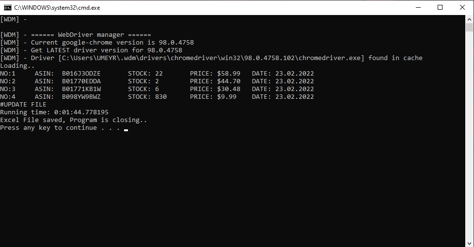
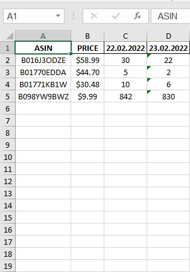

# Web Automation, Amazon Products Stock Quantities Checker Bot

## ABOUT
- It checks Amazon product's price, stock quantities and save it to excel file(or csv) into your pc. If you run daily, you may have daily data of products stock quantities. **Please see: Excel file sample (Excel_file.jpg)**

- It is help to check competitor products selling rates.

- Easy to use, open Amazonbot.bat file and bot Automatically check every ASIN you entered(no limits) to ASIN List file's(Config.py). It check their stock quantities and price. After that it prints their stock quantities, price and date then export them to an excel file.

## INSTALLATION

 - This program require python, you must install python first.

See the requirements file for installation packages;

> pip install -r requirements.txt

 Also Edit Config.py for your Amazon products and save path.

### Manual installation of packages

>pip install selenium webdriver-manager pandas openpyxl

## EXCEL FILE SAMPLE

